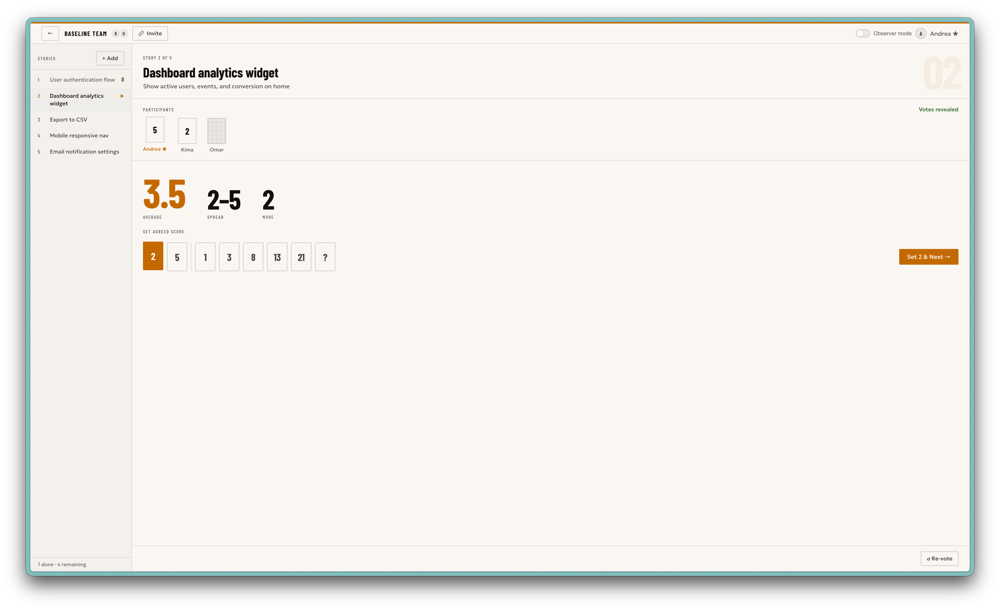

# Baseline - a practical poker planning tool

Baseline is a simple and functional multiplayer poker planning tool.



## Features
1. No signup
2. Multiplayer
3. Vote stats
4. Observer mode
4. Jira support (import, sync points and move to status or sprint)
5. Voting history (planned)

## Development

Dependencies: Node.js 18+

1. Clone the repo
```
git clone
```
2. Run the frontend
```
npm install
npm run dev
```
3. Run the backend
```
cd server
npm install
cp .env.example .env  #and set your own variables
npx prisma migrate dev
npm run dev
```

## Deployment

